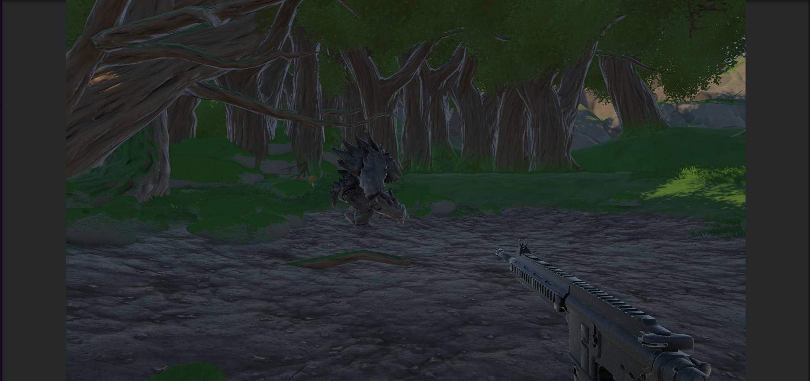
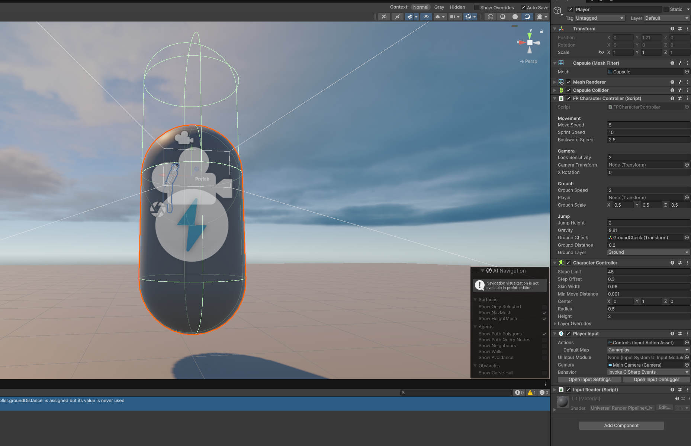
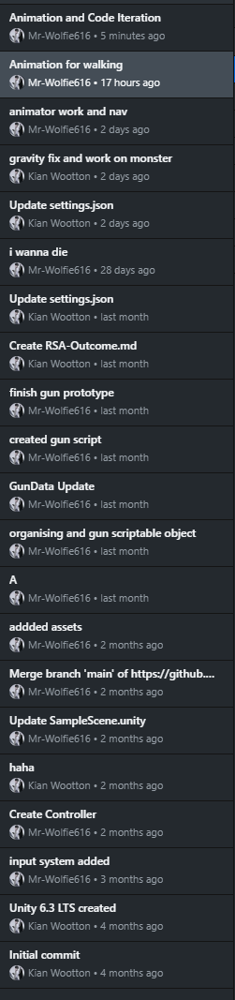
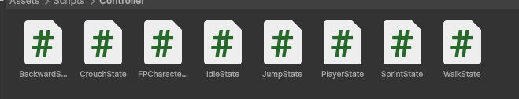
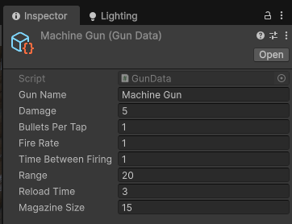
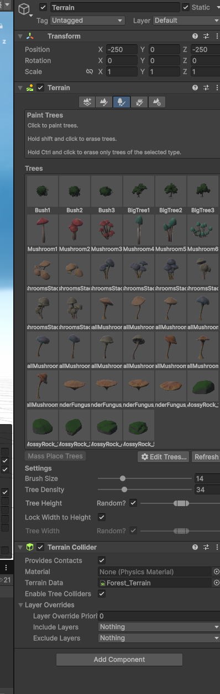
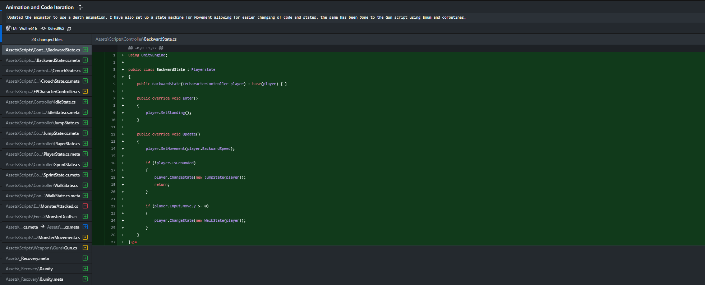

# RSA Project Outcome and Reflective Report

**Word Count:** 3,294  
**End Date:** 28/05/2026

---

# Table of Contents

1. [Introduction](#1-introduction)  
2. [Research & Preproduction](#2-research--preproduction)  
3. [Development Process](#3-development-process)  
4. [Feedback and Iteration](#4-feedback-and-iteration)  
5. [Reflection](#5-reflection)  
6. [Future Development](#6-future-development)  
7. [Conclusion](#7-conclusion)  
8. [References](#8-references)  
9. [Appendices](#9-appendices)

---

# 1. Introduction

This report talks about the development of my RSA Project Outcome prototype and shows the production process, technical implementation and thematic goals achieved throughout development. The project was created for the RSA brief about positive social change through immersive digital experiences and focused specifically on environmental destruction, misinformation and humanity’s relationship with nature.

The original RSA proposal looked at environmental sustainability and coexistence through a city building and ecosystem management concept inspired by Sustainable Development Goal 11: Sustainable Cities and Communities (United Nations, 2023). The original idea involved balancing the needs of humans, wildlife and shared environments to prevent ecological damage. However, during early development I realised that creating even a basic city management prototype within a twelve-week solo production schedule would be unrealistic. I also felt that the gameplay focused too much on managing statistics rather than creating emotional impact for the player.

As development continued the project changed into a smaller scale narrative driven experience. Rather than focusing on resource management the final prototype aimed to create emotional reflection and environmental awareness through exploration, atmosphere and narrative discovery.

The final prototype places the player in the role of a hunter sent into a forest to eliminate a creature believed to be responsible for environmental destruction. Through gameplay the player explores a forest environment and finds the monster they must kill, before finding out that humanity was destroying the environment rather than the creature. By the end of the experience the player realises they have been manipulated into killing a creature that was attempting to protect its environment from human greed and expansion.

The intended player experience was made to create feelings of guilt and betrayal while pushing players to question assumptions and authority. I wanted players to reflect on how fear and misinformation can be used to justify environmental destruction while ignoring the impact on ecosystems and wildlife.

The prototype was developed individually over a twelve-week production period using Unity 6.3 LTS (Unity Technologies, 2026), GitHub (GitHub, 2026) and iterative industry style workflow. Development included gameplay programming, AI experimentation, first-person controller systems and level construction using third-party assets. While all environment and creature assets used within the project were third-party assets, I was responsible for the layout, placement and environmental construction of the playable level using terrain and environment tools.

One of the best technical areas of the project was the player movement system. During development I transitioned from a basic first-person movement controller into a modular state-machine-based architecture like professional gameplay programming.

## Figure 1. Final Gameplay Environment



*Source: Own screenshot of Playscene, 2026.*

---

# 2. Research & Preproduction

The RSA brief focused on how immersive technologies and video games can help positive social change by influencing how players think about real-world issues. Due to this brief the project showed themes about environmental destruction, misinformation and humanity’s relationship with nature through a narrative focused experience. The project was connected to Sustainable Development Goal 11: Sustainable Cities and Communities, which highlights the importance of sustainable urban development, environmental protection and the preservation of natural spaces (United Nations, 2023).

Environmental psychology research influenced the way the game approached emotional engagement and player reflection. Research into environmental anxiety and ecological grief suggested that emotional experiences can encourage stronger reflection on environmental issues than direct informational approaches alone (Clayton, 2020). Due to this the project aimed to show its themes through player experience and atmosphere rather than large amounts of written elements or dialogue.

The project also explored psychological human needs including curiosity, emotional engagement and moral reflection. Rather than presenting players with a clear “good versus evil” narrative the game was intentionally designed to create uncertainty and guilt once the player discovered the true purpose of the creature. Existing horror and exploration games also influenced the design process especially games that show narrative through atmosphere and environmental storytelling instead of direct explanation. This research helped my decisions on level design, environmental layout, visual storytelling and player exploration. The project avoided tutorials or objective markers to encourage players to explore the environment naturally and discover the story themselves.

The project also considered accessibility and usability during development. Simple controls and limited UI systems were used to reduce unnecessary complexity during gameplay. This decision was partly made due to industry practices where environmental immersion is often prioritised within atmospheric experiences.

During preproduction the project went through changes in gameplay direction. The original RSA proposal focused on a city-building and ecosystem management game where players balanced the needs of humans, wildlife and shared environmental spaces to prevent ecological collapse. Although the idea supported the RSA theme, I felt the project would become too focused on numerical management rather than emotional engagement. I also believed that creating these systems to a polished standard within the timeframe would not be realistic. I decided to reduce the scope and redesign the project around a smaller but more emotionally focused experience.

The project became a first-person exploration game about environmental storytelling and player immersion. The narrative direction also connected more with my own interests in psychological storytelling and nature, which helped improve my motivation during production.

Early planning focused on identifying a realistic gameplay loop that could support the project themes while remaining technically manageable. Core systems identified during pre-production included first-person movement, environmental exploration, enemy AI, atmospheric visual design and basic combat mechanics. The project was intentionally scoped around creating a vertical slice prototype rather than a complete game.

---

# 3. Development Process

One of the first technical systems created during preproduction was the first-person movement controller. To begin with the controller was built using a single script handling sprinting, crouching, jumping and camera rotation. This version was designed to prioritise rapid prototyping and gameplay testing rather than long-term scalability. However, as development progressed and additional systems were introduced, I began restructuring the controller into a modular state-machine architecture like industry standard gameplay programming practices.

## Figure 2. Original Player Controller

```c#
if(input.Move.y < 0)
        {
            currentSpeed = backwardSpeed;
        }
        else if (input.Move.y > 0.1f && input.Sprint)
        {
            currentSpeed = sprintSpeed;
        }
        else if (input.Move.y > 0.1f && input.Crouch)
        {
            currentSpeed = crouchSpeed;
        }
        else
        {
            currentSpeed = moveSpeed;
        }
```

*Source: Code from visual studio, 2026.*

Developing the movement state machine became one of the most enjoyable parts of the project because I had never implemented one before. Learning how to separate movement systems into independent states improved both my understanding of scalable programming and the organisation of gameplay systems. It also showed how breaking code into smaller systems improves debugging and future iteration.

## Figure 3. State Machine System

```c#
public override void Update()
    {
        player.SetMovement(0f);

        if (!player.IsGrounded)
        {
            player.ChangeState(new JumpState(player));
            return;
        }

        if (player.Input.Crouch)
        {
            player.ChangeState(new CrouchState(player));
            return;
        }

        if (player.Input.Move.y < 0)
        {
            player.ChangeState(new BackwardState(player));
            return;
        }
    }
```

*Source: Code from Visual studio, 2026*

Another important part of preproduction involved identifying technical risks early. One challenge I had during early controller implementation involved gravity and jumping systems. To begin with jumping mechanics failed due to gravity being accidentally assigned a positive value rather than a negative value.

## Figure 4. Gravity Inversion



*Source: Own Screenshot From PlayScene, 2026*

Planning during preproduction remained small compared to previous projects because this assignment was mainly used to continue improving my programming skills and independent workflow management. Rather than using detailed production schedules, I created smaller lists of key gameplay systems and prioritised completing one feature at a time. GitHub was used throughout development to document progression and maintain version control across both my home computer and university laptop.

Development of the prototype was made using Unity 6.3 LTS alongside Visual Studio and GitHub version control. The project followed an iterative workflow where gameplay systems were first prototyped quickly before later refinement and restructuring. This approach followed common industry development practices where functionality is often prioritised during early production before later focusing on optimisation, scalability and polish.

## Figure 5. Github Push History



*Source: Own Screenshot from Github Desktop, 2026*

The first main system implemented during development was the player movement controller. Early versions of the controller were built using a single script structure handling sprinting, crouching, jumping, gravity and camera movement. This approach allowed rapid prototyping and made it easier to test movement speed, environment scale and gameplay pacing during early development.

However, as additional features were introduced the original controller became increasingly difficult to manage and iterate upon. Multiple movement behaviours were being handled inside large If statements which made debugging and future expansion more difficult. The movement system was later redesigned using a modular state machine structure.

The state-machine movement system separated player movement behaviours into individual states including Idle State, Walk State, Sprint State, Jump State, Crouch State and Backward Movement State. Each movement state handled its own behaviour and transition conditions independently. This improved code readability, maintainability and scalability while also making debugging easier during development. The movement state system became one of the best technical aspects of the project because it showed a more industry standard programming structure compared to previous controllers I had created.

## Figure 6. Player Controller Folder



*Source: Own Screenshot from Unity, 2026*

Player feedback also directly influenced controller iteration. Early playtesting identified that the original movement speed felt too fast and reduced gameplay tension during exploration. Testers also noted that crouching did not reduce player height enough which weakned atmosphere. As a result, crouch scaling and movement speed values were adjusted to better support slower exploration. Another issue discovered through testing allowed the player to sprint while crouching due to overlapping movement conditions. This bug was later corrected to make sure crouching remained slower than sprinting.

The game combat systems were also developed during production. One of the gameplay features I was most proud of creating was the weapon system because I had never previously developed a functional gun mechanic independently. The gun system used Scriptable Objects and state management to handle firing behaviour and supported future scalability.

## Figure 7. Sctiptable Object Gun



*Source: Own screenshot from Unity, 2026*

Enemy functionality and monster animation systems also showed technical learning throughout production. In previous group projects AI systems and animation systems had mainly been handled by other team members. Because of this implementing enemy movement and animation independently became one of the more challenging aspects of the project. Basic enemy navigation and animation transitions were implemented using Unity’s NavMesh system and animation controllers. Although the AI remained simple the system helped the gameplay atmosphere and narrative progression.

## Figure 8. Creature animation and movement 

[](https://youtu.be/54p70t5DkOU)

*Source: Own Video from Unity, 2026*

The monster animation system also required technical adjustments because several third-party assets initially failed to function correctly within the version of Unity used during development. In particular, the creature materials and shaders were incompatible with the Universal Render Pipeline. To fix this issue materials were converted into URP-compatible complex lit shaders which fixed the textures and rendering.

Environmental development focused on atmosphere and environmental storytelling using third-party assets. I was responsible for the environmental layout and terrain construction through the prototype. The game environment began feeling more complete once both the player and enemy systems were functioning correctly inside the playable scene.

## Figure 9. Terrian Tool



*Source: Own screenshot from Unity, 2026*

Throughout development GitHub version control was used to manage workflow and progression. GitHub allowed development to continue across both my home desktop computer and university laptop while also providing a clear record of iteration throughout production. Commit logs documented major technical changes including controller redesigns, animation implementation, environment updates and gameplay system iteration.

One of the production challenges involved balancing development time against personal health issues and the workload demands of another large group project being completed simultaneously. Due to these limitations, several planned features were removed or reduced in scope during later production stages. Planned systems originally included a more advanced combat AI, multiple enemy encounters, additional weapon types, environmental creature behaviour, voice acted narration, larger exploration areas and ambient wildlife systems.

Although these features were removed due to time and scope limitations reducing the project scope helped the prototype remain stable and playable while maintaining its core emotional and environmental themes.

---

# 4. Feedback and Iteration

Feedback was mainly gathered informally from peers, tutor and previous experiences from earlier university projects. Due to personal health issues and the workload demands of another group project, playtesting opportunities became limited during later development stages. The prototype was also not fully ready in time for Code and Canvas which lessened opportunities for wider public testing and external feedback.

Despite these limitations feedback gathered during earlier development stages still helped gameplay systems particularly the player controller. Much of the movement feedback came from testing previous projects where similar first person movement systems had been implemented, this can be seen on my group project called [Quebec Underground](https://hollowwolf.co.uk/client_project_report.html). Earlier testing found that movement speed felt too fast and reduced gameplay tension because players could move through environments too quickly without properly engaging with the atmosphere or environmental detail. To improve this the movement speeds were reduced to encourage slower exploration and create a more cautious gameplay pace.

## Figure 10. Player Movement

[](https://youtu.be/lwCh_zujytY)

*Source: Own video from Unity, 2026*

The crouch system was also iterated on based on player feedback. Early versions of the crouch mechanic did not reduce player height enough which made gameplay feel visually unclear and less immersive. To improve this crouch scaling values were adjusted to make the player physically lower within the environment, improving both visual feedback and gameplay readability.

Another gameplay issue found during testing involved overlapping movement conditions within the original movement controller. Testers discovered that players were able to sprint while crouching due to the way movement conditions were being checked inside the controller script. This unintentionally removed the gameplay disadvantage of crouching. The movement conditions were later redone to prevent crouch movement from overlapping with sprint states.

The enemy AI systems also underwent iteration throughout production. The monster movement system originally lacked animation transitions making encounters feel unnatural. Animation systems and navigation logic were later improved using Unity’s NavMesh system and animation controllers.

The weapon system similarly changed throughout production. Early prototypes focused mainly on achieving functional shooting mechanics before later adding state handling, coroutines and Scriptable Object support. Structuring the weapon system using Scriptable Objects improved scalability and would have allowed additional weapons to be added more easily if development had continued further.

## Figure 11. Updated Gun Scripted

```
 private void Awake()
    {
        input = FindAnyObjectByType<InputReader>();
        currentAmmo = gunData.magazineSize;

        ChangeState(GunState.Idle);
    }

    private void Update()
    {
        Input();

        Debug.DrawLine(playerCam.transform.position,playerCam.transform.position + playerCam.transform.forward * gunData.range, Color.red);
    }

    private void Input()
    {
        if (input.Reload && currentAmmo < gunData.magazineSize)
        {
            TryReload();
            return;
        }

        if(input.Fire)
        {
            TryShoot();
        }
    }
```

*Source: Own code from visual studio, 2026*

Due to time and scope limitations, several planned gameplay systems were never fully implemented. Although these systems were removed from production reducing the scope helped prioritise the completion of core gameplay systems and environmental storytelling. This showed the importance of realistic production planning and iterative scope management during solo game development.

---

# 5. Reflection

Overall, the project achieved many of its original thematic goals despite several technical and production limitations. One part of the final prototype was its ability to communicate environmental themes through atmosphere, exploration and narrative rather than relying on direct explaination or written explanation. The project encouraged players to gradually question their assumptions about the world and the creature they were hunting which aligned with the RSA brief about positive social reflection through immersive experiences.

One of the main emotional goals of the project was creating feelings of guilt, betrayal and uncertainty once the player discovered humanity was responsible for the destruction of the environment rather than the creature itself. I wanted players to question the information they had been given throughout the game and reflect on how fear and misinformation can influence attitudes towards nature and wildlife. This idea was affected by my own feelings for animals and natural environments, as well as concerns surrounding humanity’s exploitation of ecosystems for resources and expansion.

The environmental storytelling approach also helped reinforce Sustainable Development Goal 11 by encouraging reflection surrounding humanity’s relationship with natural environments and the consequences of environmental destruction (United Nations, 2023). Although the project did not simulate a sustainable city or urban planning like the original proposal the final prototype still explored themes surrounding environmental responsibility, ecological preservation and the long-term impact of human expansion on natural spaces.

The gun and animation systems also showed my technical growth throughout development because I had never independently implemented these systems before. Developing these mechanics improved my confidence with gameplay scripting, animation implementation and gameplay state management. Although both systems remained simple in their final form, they helped the gameplay experience and thematic atmosphere of the prototype.

However, the project also had weaknesses throughout production. Due to time limitations, health issues and the workload demand of another major university project many features were removed or simplified during later production stages. While this reduced the overall scale of the final prototype it also improved my understanding of realistic production management and the importance of prioritising core systems over feature expansion during solo development.

The project also lacked wider playtesting opportunities due to the prototype not being fully prepared in time for Code and Canvas. Feedback mainly came from smaller peer discussions and earlier gameplay testing rather than large scale public testing. This limited the amount of external feedback available for balancing and user experience refinement during later development stages.

GitHub commit history showed consistent progression and experimentation across gameplay systems, controller redesigns and environmental development. The project also showed the importance of modular workflows, realistic scoping and iterative problem solving during independent game development.

## Figure 5. GitHub Push History


*Source: Own Screenshot from GitHub Desktop, 2026.*

## Figure 12. Github Commits



*Source: Own screenshot from Github, 2026*

---

# 6. Future Development

Although the final prototype successfully communicated many of its intended environmental and emotional themes there are several areas that could be expanded and improved in future development. Due to the project being developed individually within a limited production schedule many planned systems were simplified or removed to prioritise core gameplay mechanics and environmental storytelling.

One planned addition involved expanding the enemy and combat systems. Initially the game was intended to include multiple creatures throughout the forest environment rather than a single enemy encounter. The combat systems were also originally planned to become more advanced. While the current weapon system showed basic shooting mechanics future development would expand combat interactions through additional weapon types, improved enemy reactions, expanded AI behaviour, better animation transitions and combat audio.

The current gun system was intentionally designed using Scriptable Objects and modular state management to support scalability if additional weapons were implemented later in development. This showed industry standard programming approaches where reusable systems are designed to support future content expansion without requiring large structural changes.

The enemy AI system would also benefit from further development. The current AI supports basic wander behaviour; however future versions would include patrol behaviours, investigation systems, search behaviour and reactions to player actions.

Additional environmental systems including wildlife creatures and ambient interactions were planned during early production stages but removed due to scope limitations. These systems would have helped the environment feel more alive and immersive.

Audio design represented another area for future improvement. Originally, the project was planned to include voice acted narration and environmental ambience to improve immersion and reinforce the narrative themes.

Narratively future versions of the project could also expand environmental storytelling and player choice systems. Currently the prototype follows a mostly linear progression towards the final reveal. However, development could introduce multiple endings or moral choices allowing players to either continue supporting human expansion or reject the mission entirely after discovering the truth surrounding the creatures and environmental destruction.

---

# 7. Conclusion

In conclusion, the RSA Project Outcome successfully showed how immersive digital experiences can be used to encourage emotional reflection surrounding environmental destruction, misinformation and humanity’s relationship with nature. Although the final prototype changed significantly from the original RSA proposal the project remained connected to the core themes of sustainability, ecological responsibility and positive social awareness throughout development.

Throughout development the project showed evidence of technical and professional growth. One example of this was the redesign of the player movement controller from a single-script implementation into a modular state-machine architecture. This process improved code organisation, scalability and maintainability while also improving my understanding of industry-standard gameplay programming workflows. The development of the gun systems, enemy AI and animation systems also proved major areas of technical growth because these were systems, I had not previously developed independently.

The project also showed the importance of iterative development and realistic scope management during solo production. Several planned systems including advanced enemy AI, multiple weapons, environmental wildlife systems and voice acted narration were removed or simplified due to time limitations, personal health issues and the workload demand of another major university project. Although these compromises reduced the overall scale of the final prototype, they helped prioritise the completion of core gameplay systems and environmental storytelling rather than leaving the project unfinished or unstable.

The final prototype showed the emotional and environmental themes originally intended during development. While the game remained small in scope it showed how interactive experiences can encourage players to question assumptions, reflect on environmental issues and engage emotionally with narrative experiences. The project also helped my growing interest in gameplay programming, atmospheric game design and environmental storytelling.

---

# 8. References

Clayton, S. (2020) Climate anxiety: Psychological responses to climate change. Journal of Anxiety Disorders.

GitHub (2026) GitHub Documentation. Available at: https://github.com/Mr-Wolfie616 (Accessed: 28 May 2026).

Unity Technologies (2026) Unity Documentation. Available at: https://docs.unity3d.com/ (Accessed: 28 May 2026).

United Nations (2023) Sustainable Development Goal 11: Sustainable Cities and Communities. Available at: https://sdgs.un.org/goals/goal11 (Accessed: 28 May 2026).

Wootton, K. (2026) RSA Project Development Video. YouTube. Available at: https://www.youtube.com/watch?v=fGbOGE2m2HE&t=105s (Accessed: 28 May 2026).

MONSTER FULL PACK VOL 2 (2023) @UnityAssetStore. Unity Asset Store Available at: https://assetstore.unity.com/packages/3d/characters/creatures/monster-full-pack-vol-2-238395. [Accessed 29 May 2026].

Pure Nature 2 : Fantasy Forest (2025) @UnityAssetStore. Unity Asset Store Available at: https://assetstore.unity.com/packages/3d/environments/pure-nature-2-fantasy-forest-282665. [Accessed 29 May 2026].

Rifle HK416 - Free (2022) @UnityAssetStore. Unity Asset Store Available at: https://assetstore.unity.com/packages/3d/props/guns/rifle-hk416-free-351370. [Accessed 29 May 2026].

Unity Asset Store - The Best Assets for Game Making (n.d.) Assetstore.unity.com. Available at: https://assetstore.unity.com.

Wootton, K. (2026) Slacker And Red Rat Client Project Reflective Report. Hollowwolf.co.uk. Available at: https://hollowwolf.co.uk/client_project_report.html. [Accessed 29 May 2026].

---

# 9. Appendices

---

# Appendix A – Final Gameplay Environment

This appendix contains a screenshot of the final playable forest environment used within the prototype.

## Figure 1. Final Gameplay Environment


*Source: Own screenshot of Playscene, 2026.*

Referenced in:
- Section 1 – Introduction

---

# Appendix B – Original Player Controller

This appendix shows the original first-person movement controller before transitioning to a modular state-machine structure.

## Figure 2. Original Player Controller

```c#
if(input.Move.y < 0)
        {
            currentSpeed = backwardSpeed;
        }
        else if (input.Move.y > 0.1f && input.Sprint)
        {
            currentSpeed = sprintSpeed;
        }
        else if (input.Move.y > 0.1f && input.Crouch)
        {
            currentSpeed = crouchSpeed;
        }
        else
        {
            currentSpeed = moveSpeed;
        }
```

*Source: Code from Visual Studio, 2026.*

Referenced in:
- Section 3 – Development Process

---

# Appendix C – State Machine System

This appendix shows the modular state-machine structure used to improve gameplay programming organisation and scalability.

## Figure 3. State Machine System

```c#
public override void Update()
    {
        player.SetMovement(0f);

        if (!player.IsGrounded)
        {
            player.ChangeState(new JumpState(player));
            return;
        }

        if (player.Input.Crouch)
        {
            player.ChangeState(new CrouchState(player));
            return;
        }

        if (player.Input.Move.y < 0)
        {
            player.ChangeState(new BackwardState(player));
            return;
        }
    }
```

*Source: Code from Visual Studio, 2026.*

Referenced in:
- Section 3 – Development Process

---

# Appendix D – Gravity Debugging

This appendix contains a screenshot of the gravity inversion issue that caused the jump mechanic to fail during early development.

## Figure 4. Gravity Inversion


*Source: Own Screenshot From PlayScene, 2026.*

Referenced in:
- Section 3 – Development Process

---

# Appendix E – GitHub Version Control

This appendix shows GitHub Desktop commit history used to manage version control and workflow progression throughout production.

## Figure 5. GitHub Push History


*Source: Own Screenshot from GitHub Desktop, 2026.*

Referenced in:
- Section 3 – Development Process
- Section 5 – Reflection

---

# Appendix F – Modular Player Controller Structure

This appendix contains the folder structure used for the modular movement system and player controller states.

## Figure 6. Player Controller Folder


*Source: Own Screenshot from Unity, 2026.*

Referenced in:
- Section 3 – Development Process

---

# Appendix G – Weapon System Development

This appendix shows the Scriptable Object setup used for the weapon system.

## Figure 7. Scriptable Object Gun


*Source: Own Screenshot from Unity, 2026.*

Referenced in:
- Section 3 – Development Process
- Section 4 – Feedback and Iteration

---

# Appendix H – Creature Animation and Movement

This appendix contains a development video showing the enemy movement and animation system.

## Figure 8. Creature Animation and Movement

[](https://youtu.be/54p70t5DkOU)

*Source: Own Video from Unity, 2026.*

Referenced in:
- Section 3 – Development Process

---

# Appendix I – Terrain Construction

This appendix shows the Unity terrain tool used to construct the forest environment.

## Figure 9. Terrain Tool


*Source: Own Screenshot from Unity, 2026.*

Referenced in:
- Section 3 – Development Process

---

# Appendix J – Player Movement Iteration

This appendix contains a development video showing iteration and improvements to the player movement system.

## Figure 10. Player Movement

[](https://youtu.be/lwCh_zujytY)

*Source: Own Video from Unity, 2026.*

Referenced in:
- Section 4 – Feedback and Iteration

---

# Appendix K – Updated Weapon Script

This appendix contains an updated version of the weapon system script showing improvements made during development.

## Figure 11. Updated Gun Script

```c#
 private void Awake()
    {
        input = FindAnyObjectByType<InputReader>();
        currentAmmo = gunData.magazineSize;

        ChangeState(GunState.Idle);
    }

    private void Update()
    {
        Input();

        Debug.DrawLine(playerCam.transform.position,playerCam.transform.position + playerCam.transform.forward * gunData.range, Color.red);
    }

    private void Input()
    {
        if (input.Reload && currentAmmo < gunData.magazineSize)
        {
            TryReload();
            return;
        }

        if(input.Fire)
        {
            TryShoot();
        }
    }
```

*Source: Own code from Visual Studio, 2026.*

Referenced in:
- Section 4 – Feedback and Iteration

---

# Appendix L – GitHub Commit Example

This appendix shows examples of GitHub commit descriptions documenting gameplay changes and technical iteration throughout development.

## Figure 12. GitHub Commit Description


*Source: Own Screenshot from GitHub, 2026.*

Referenced in:
- Section 5 – Reflection